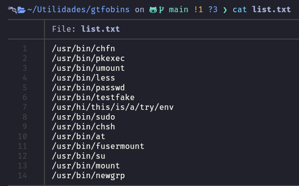
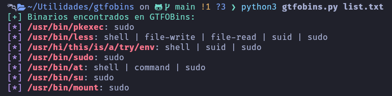
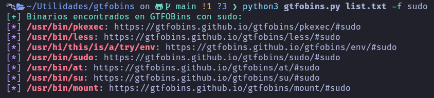

# gtfobins
Searches for binaries on GTFOBins from a text file containing binary paths.

## Use - Help
```
python3 gtfobins.py -h
```

## Use - All functions
```
python3 gtfobins.py list.txt
```

## Use - Specific function (-f)
```
python3 gtfobins.py list.txt -f sudo
```

## Example list


## All functions


## Specific function

