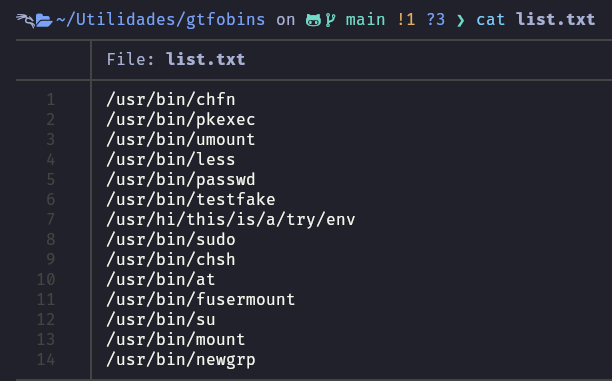
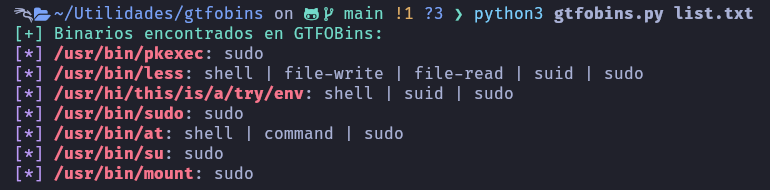
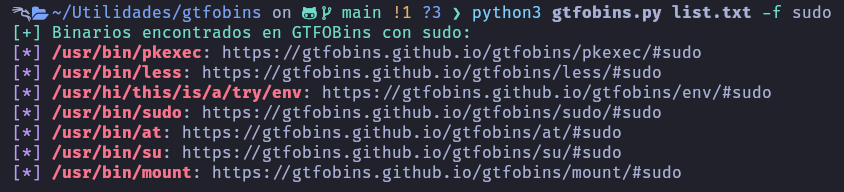

# gtfobins
Searches for binaries on GTFOBins from a text file containing binary paths, with the option to filter results by specific functions like sudo, suid, etc.

#Install
```
wget https://raw.githubusercontent.com/Felidvnn/gtfobins/main/gtfobins.py

```
## Use - Help
```
python3 gtfobins.py -h

```

## Use - All functions
```
python3 gtfobins.py list.txt

```

## Use - Specific function (-f)
```
python3 gtfobins.py list.txt -f sudo

```

## Example list


## All functions


## Specific function

